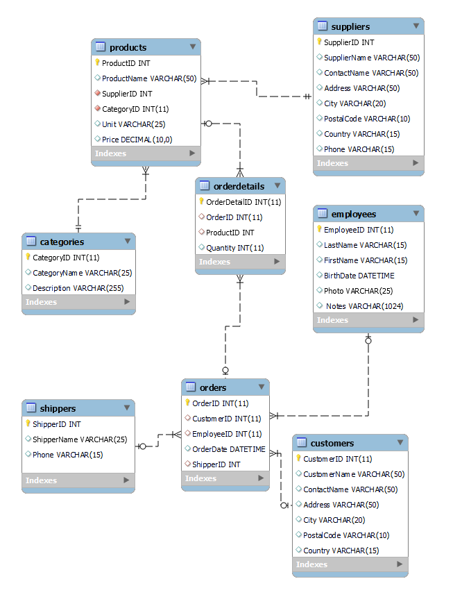

# Dokumentácia ETL procesu - Northwind Databáza

## 1. Úvod a popis zdrojových dát

Projekt sa zameriava na analýzu obchodných dát z Northwind databázy, ktorá obsahuje informácie o objednávkach, zákazníkoch, produktoch a predajoch. Cieľom analýzy je identifikovať predajné trendy, sledovať výkonnosť produktov a analyzovať správanie zákazníkov pre optimalizáciu obchodných procesov.

### Popis zdrojových tabuliek:

- **Categories**: Obsahuje kategórie produktov s ich názvami a popismi
- **Customers**: Uchováva informácie o zákazníkoch vrátane kontaktných údajov a lokality
- **Employees**: Eviduje údaje o zamestnancoch spoločnosti
- **Products**: Katalóg všetkých produktov s cenami a skladovými informáciami
- **Orders**: Hlavičky objednávok obsahujúce základné informácie o každej objednávke
- **OrderDetails**: Detailné položky jednotlivých objednávok
- **Shippers**: Informácie o prepravných spoločnostiach
- **Suppliers**: Údaje o dodávateľoch produktov

### ERD diagram zdrojových dát:


*Obrázok 1: Entitno-relačná schéma Northwind databázy*

## 2. Návrh dimenzionálneho modelu


*Obrázok 2: Hviezdicová schéma Northwind dátového skladu*

### Faktová tabuľka (facts_orderdetails):

Hlavné metriky:
- Množstvo predaných jednotiek (Quantity)
- Celková cena (OverallPrice)
- ID objednávky (OrderID)
- Cudzie kľúče na všetky dimenzie

### Dimenzionálne tabuľky:

1. **dim_order_date** (SCD Typ 0)
   - Časová dimenzia obsahujúca hierarchie dní, týždňov, mesiacov a rokov
   - Umožňuje analýzu trendov v čase

2. **dim_order_time** (SCD Typ 0)
   - Denná časová dimenzia s členením na hodiny a časti dňa
   - Slúži na analýzu predajov počas dňa

3. **dim_employees** (SCD Typ 1)
   - Informácie o zamestnancoch
   - Aktualizuje sa pri zmene údajov zamestnanca

4. **dim_products** (SCD Typ 2)
   - Údaje o produktoch a ich kategóriách
   - Zachováva históriu zmien v produktových informáciách

5. **dim_suppliers** (SCD Typ 1)
   - Informácie o dodávateľoch
   - Aktualizuje sa pri zmene údajov dodávateľa

6. **dim_shippers** (SCD Typ 1)
   - Údaje o prepravcoch
   - Aktualizuje sa pri zmene informácií o prepravcovi

7. **dim_customers** (SCD Typ 1)
   - Informácie o zákazníkoch
   - Aktualizuje sa pri zmene zákazníckych údajov

## 3. ETL proces v nástroji Snowflake

### 3.1 Extract (Extrahovanie dát)

Vytvorenie databázy a staging schémy:

```sql
CREATE DATABASE BLUEJAY_NORTHWIND;
CREATE SCHEMA BLUEJAY_NORTHWIND.staging;
USE SCHEMA BLUEJAY_NORTHWIND.staging;
```

Vytvorenie staging tabuliek:

```sql
CREATE OR REPLACE TABLE Categories_staging (
    CategoryID INTEGER,
    CategoryName VARCHAR(25),
    Description VARCHAR(255)
);

CREATE OR REPLACE TABLE Customers_staging (
    CustomerID INTEGER,
    CustomerName VARCHAR(50),
    ContactName VARCHAR(50),
    Address VARCHAR(50),
    City VARCHAR(20),
    PostalCode VARCHAR(10),
    Country VARCHAR(15)
);
```

Nahranie dát do staging tabuliek:

```sql
CREATE OR REPLACE STAGE my_stage;

COPY INTO Categories_staging
FROM @my_stage/categories.csv
FILE_FORMAT = (TYPE = 'CSV' FIELD_OPTIONALLY_ENCLOSED_BY = '"' SKIP_HEADER = 1)
ON_ERROR = 'CONTINUE';
```

### 3.2 Transform (Transformácia dát)

Vytvorenie časovej dimenzie:

```sql
CREATE OR REPLACE TABLE dim_order_date AS
SELECT
    TO_NUMBER(TO_CHAR(OrderDate, 'YYYYMMDD')) as iddim_order_date,
    CAST(OrderDate AS DATE) as timestamp,
    DATE_PART(day, OrderDate) as day,
    DATE_PART(dow, OrderDate) + 1 as dayOfWeek,
    DATE_PART(month, OrderDate) as month,
    DATE_PART(quarter, OrderDate) as quarter,
    DATE_PART(year, OrderDate) as year
FROM Orders_staging
GROUP BY OrderDate;
```

Vytvorenie produktovej dimenzie:

```sql
CREATE OR REPLACE TABLE dim_products AS
SELECT 
    p.ProductID,
    p.ProductName,
    p.Unit,
    p.Price,
    c.CategoryName as Category
FROM Products_staging p
JOIN Categories_staging c ON p.CategoryID = c.CategoryID;
```

### 3.3 Load (Načítanie dát)

Vytvorenie faktovej tabuľky:

```sql
CREATE OR REPLACE TABLE facts_orderdetails AS
SELECT 
    od.OrderDetailID as fact_orderDetailID,
    od.OrderID,
    od.Quantity,
    od.Quantity * p.Price as OverallPrice,
    o.OrderDate,
    TO_NUMBER(TO_CHAR(o.OrderDate, 'YYYYMMDD')) as dim_order_date_iddim_order_date,
    o.EmployeeID as dim_employees_EmployeeID,
    od.ProductID as dim_products_ProductID,
    p.SupplierID as dim_suppliers_SupplierID,
    o.ShipperID as dim_shippers_ShipperID,
    o.CustomerID as dim_customers_CustomerID
FROM OrderDetails_staging od
JOIN Orders_staging o ON od.OrderID = o.OrderID
JOIN Products_staging p ON od.ProductID = p.ProductID;
```

### 5. WIP
