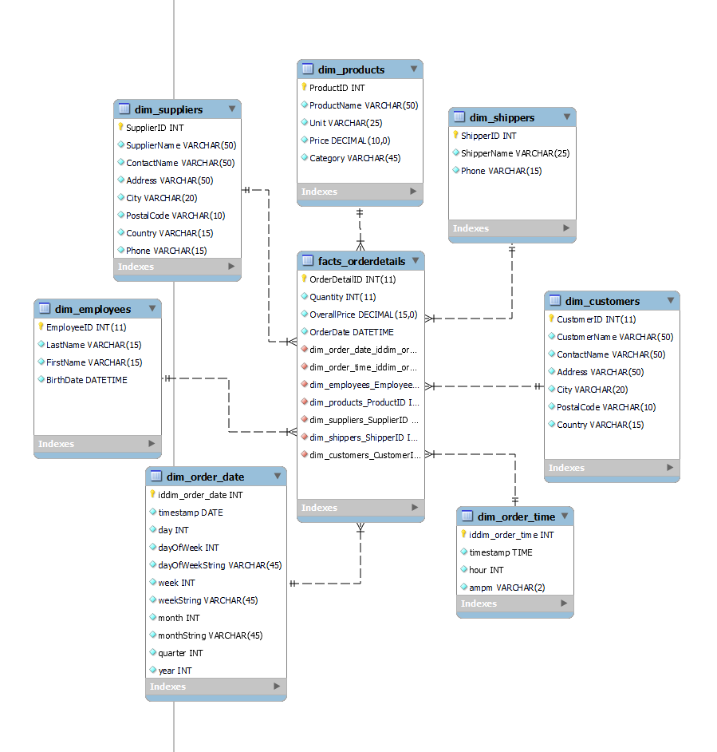
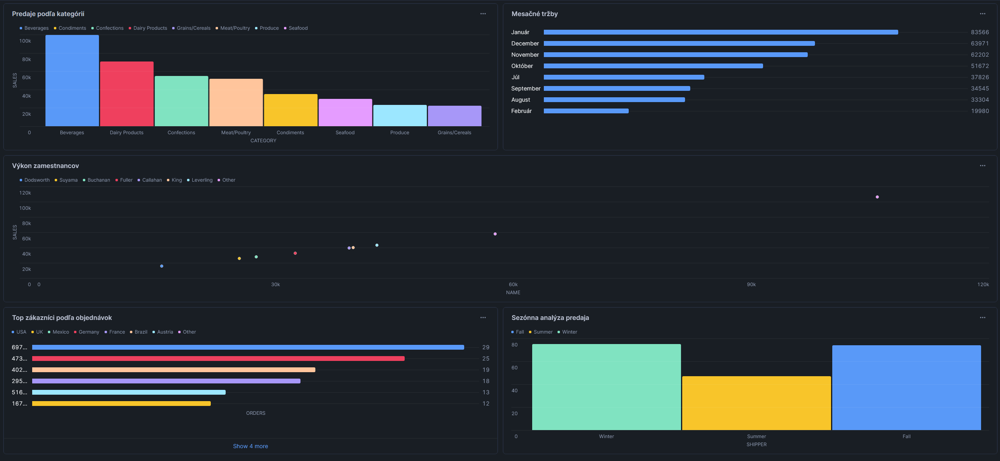

# Dokumentácia ETL procesu - Northwind Databáza

## 1. Úvod a popis zdrojových dát

Projekt sa zameriava na analýzu obchodných dát z Northwind databázy, ktorá obsahuje informácie o objednávkach, zákazníkoch, produktoch a predajoch. Cieľom analýzy je identifikovať predajné trendy, sledovať výkonnosť produktov a analyzovať správanie zákazníkov pre optimalizáciu obchodných procesov.

### Popis zdrojových tabuliek:

- **Categories**: Obsahuje kategórie produktov s ich názvami a popismi
- **Customers**: Uchováva informácie o zákazníkoch vrátane kontaktných údajov a lokality
- **Employees**: Eviduje údaje o zamestnancoch spoločnosti
- **Products**: Katalóg všetkých produktov s cenami a skladovými informáciami
- **Orders**: Hlavičky objednávok obsahujúce základné informácie o každej objednávke
- **OrderDetails**: Detailné položky jednotlivých objednávok
- **Shippers**: Informácie o prepravných spoločnostiach
- **Suppliers**: Údaje o dodávateľoch produktov

### ERD diagram zdrojových dát:


*Obrázok 1: Entitno-relačná schéma Northwind databázy*

## 2. Návrh dimenzionálneho modelu

Star schéma je fundamentálny prístup k dimenzionálnemu modelovaniu dát, ktorý je implementovaný v Northwind dátovom sklade. Tento model je charakteristický svojou centrálnou faktovou tabuľkou prepojenou s okolitými dimenzionálnymi tabuľkami.



*Obrázok 2: Hviezdicová schéma Northwind dátového skladu*

### Faktová tabuľka (facts_orderdetails):

Hlavné metriky:
- Množstvo predaných jednotiek (Quantity)
- Celková cena (OverallPrice)
- ID objednávky (OrderID)
- Cudzie kľúče na všetky dimenzie

### Dimenzionálne tabuľky:

1. **dim_order_date** (SCD Typ 0)
   - Časová dimenzia obsahujúca hierarchie dní, týždňov, mesiacov a rokov
   - Umožňuje analýzu trendov v čase

2. **dim_order_time** (SCD Typ 0)
   - Denná časová dimenzia s členením na hodiny a časti dňa
   - Slúži na analýzu predajov počas dňa

3. **dim_employees** (SCD Typ 1)
   - Informácie o zamestnancoch
   - Aktualizuje sa pri zmene údajov zamestnanca

4. **dim_products** (SCD Typ 2)
   - Údaje o produktoch a ich kategóriách
   - Zachováva históriu zmien v produktových informáciách

5. **dim_suppliers** (SCD Typ 1)
   - Informácie o dodávateľoch
   - Aktualizuje sa pri zmene údajov dodávateľa

6. **dim_shippers** (SCD Typ 1)
   - Údaje o prepravcoch
   - Aktualizuje sa pri zmene informácií o prepravcovi

7. **dim_customers** (SCD Typ 1)
   - Informácie o zákazníkoch
   - Aktualizuje sa pri zmene zákazníckych údajov

## 3. ETL proces v nástroji Snowflake

ETL (Extract, Transform, Load) proces v nástroji Snowflake je komplexný proces pozostávajúci z troch hlavných fáz, ktoré slúžia na prípravu dát pre analytické účely. Tento proces využíva vlastnosti a funkcie Snowflake na efektívne spracovanie a transformáciu dát.

### 3.1 Extract (Extrahovanie dát)

Táto časť sa zameriava na prípravu prostredia a počiatočné načítanie dát:

Prvý SQL blok vytvára základnú infraštruktúru:

- Vytvára novú databázu BLUEJAY_NORTHWIND
- V rámci nej vytvára staging schému
- Prepína kontext na používanie tejto schémy


```sql
CREATE DATABASE BLUEJAY_NORTHWIND;
CREATE SCHEMA BLUEJAY_NORTHWIND.staging;
USE SCHEMA BLUEJAY_NORTHWIND.staging;
```

Druhý SQL blok definuje staging tabuľky:


- Categories_staging: ukladá kategórie produktov s ID, názvom a popisom
- Customers_staging: obsahuje informácie o zákazníkoch vrátane kontaktných údajov a adresy
- Tieto tabuľky slúžia ako dočasné úložisko pre surové dáta pred ich transformáciou.

```sql
CREATE OR REPLACE TABLE Categories_staging (
    CategoryID INTEGER,
    CategoryName VARCHAR(25),
    Description VARCHAR(255)
);

CREATE OR REPLACE TABLE Customers_staging (
    CustomerID INTEGER,
    CustomerName VARCHAR(50),
    ContactName VARCHAR(50),
    Address VARCHAR(50),
    City VARCHAR(20),
    PostalCode VARCHAR(10),
    Country VARCHAR(15)
);
```

Tretí SQL blok sa zaoberá samotným nahrávaním dát:


- Vytvára stage priestor (my_stage) pre nahrávanie súborov
- Používa COPY INTO príkaz pre nahratie CSV súboru
- Definuje formát súboru (CSV s voliteľnými úvodzovkami)
- Obsahuje error handling (ON_ERROR = 'CONTINUE')

```sql
CREATE OR REPLACE STAGE my_stage;

COPY INTO Categories_staging
FROM @my_stage/categories.csv
FILE_FORMAT = (TYPE = 'CSV' FIELD_OPTIONALLY_ENCLOSED_BY = '"' SKIP_HEADER = 1)
ON_ERROR = 'CONTINUE';
```

### 3.2 Transform (Transformácia dát)

V tejto fáze sa surové dáta transformujú do dimenzionálneho modelu:

- Časová dimenzia (dim_order_date):
- Vytvára komplexnú časovú dimenziu z dátumov objednávok
- Extrahuje rôzne časové komponenty: deň, deň v týždni, mesiac, štvrťrok, rok
- Používa GROUP BY pre odstránenie duplicít
- Vytvára unikátny kľúč vo formáte YYYYMMDD

```sql
CREATE OR REPLACE TABLE dim_order_date AS
SELECT
    TO_NUMBER(TO_CHAR(OrderDate, 'YYYYMMDD')) as iddim_order_date,
    CAST(OrderDate AS DATE) as timestamp,
    DATE_PART(day, OrderDate) as day,
    DATE_PART(dow, OrderDate) + 1 as dayOfWeek,
    DATE_PART(month, OrderDate) as month,
    DATE_PART(quarter, OrderDate) as quarter,
    DATE_PART(year, OrderDate) as year
FROM Orders_staging
GROUP BY OrderDate;
```

- Produktová dimenzia (dim_products):
- Spája produkty s ich kategóriami pomocou JOIN
- Obsahuje základné informácie o produktoch: názov, jednotku, cenu
- Denormalizuje kategóriu produktu pre lepší výkon dotazov

```sql
CREATE OR REPLACE TABLE dim_products AS
SELECT 
    p.ProductID,
    p.ProductName,
    p.Unit,
    p.Price,
    c.CategoryName as Category
FROM Products_staging p
JOIN Categories_staging c ON p.CategoryID = c.CategoryID;
```

### 3.3 Load (Načítanie dát)

Posledná fáza vytvára centrálnu faktovú tabuľku:

- Spája dáta z viacerých staging tabuliek (OrderDetails, Orders, Products)
- Počíta odvodené metriky (OverallPrice ako Quantity * Price)
- Vytvára cudzie kľúče pre všetky relevantné dimenzie
- Zachováva granularitu na úrovni jednotlivých položiek objednávky
- Obsahuje všetky potrebné väzby na dimenzionálne tabuľky pomocou ID stĺpcov


```sql
CREATE OR REPLACE TABLE facts_orderdetails AS
SELECT 
    od.OrderDetailID as fact_orderDetailID,
    od.OrderID,
    od.Quantity,
    od.Quantity * p.Price as OverallPrice,
    o.OrderDate,
    TO_NUMBER(TO_CHAR(o.OrderDate, 'YYYYMMDD')) as dim_order_date_iddim_order_date,
    t.iddim_order_time as dim_order_time_iddim_order_time,
    o.EmployeeID as dim_employees_EmployeeID,
    od.ProductID as dim_products_ProductID,
    p.SupplierID as dim_suppliers_SupplierID,
    o.ShipperID as dim_shippers_ShipperID,
    o.CustomerID as dim_customers_CustomerID
FROM OrderDetails_staging od
JOIN Orders_staging o ON od.OrderID = o.OrderID
JOIN Products_staging p ON od.ProductID = p.ProductID
JOIN dim_order_time t ON TO_TIME(o.OrderDate) = t.timestamp;


```
V poslednej časti SQL kódu po vytvorení faktovej tabuľky nasleduje séria DROP TABLE príkazov, ktoré majú dôležitý účel v ETL procese:
```sql
DROP TABLE IF EXISTS Categories_staging;
DROP TABLE IF EXISTS Customers_staging;
DROP TABLE IF EXISTS Employees_staging;
DROP TABLE IF EXISTS Shippers_staging;
DROP TABLE IF EXISTS Suppliers_staging;
DROP TABLE IF EXISTS Products_staging;
DROP TABLE IF EXISTS Orders_staging;
DROP TABLE IF EXISTS OrderDetails_staging;
```
Tieto príkazy:

- Odstraňujú všetky staging tabuľky po úspešnom vytvorení faktovej tabuľky
- Používajú konštrukciu IF EXISTS na zabezpečenie, že príkaz nespôsobí chybu ak tabuľka neexistuje
- Pomáhajú udržiavať čistotu a poriadok v databáze odstránením dočasných tabuliek
- Šetria úložný priestor, keďže dáta už boli transformované a presunuté do dimenzionálneho modelu
- Predstavujú best practice v ETL procesoch, kde staging tabuľky slúžia len ako dočasné úložisko

Je to dôležitý krok z hľadiska údržby a správy databázy, pretože staging tabuľky už nie sú potrebné po úspešnom dokončení ETL procesu a ich ponechanie by mohlo viesť k zbytočnému zaberaniu priestoru a potenciálnej nejasnosti v štruktúre databázy.

Celý tento ETL proces je navrhnutý tak, aby vytvoril dobre štruktúrovaný dimenzionálny model vhodný pre analytické účely, s jasným oddelením faktov a dimenzií.

## 4. Vizualizácia dát

Vytvorený bol interaktívny dashboard obsahujúci vizualizácie všetkých kľúčových metrík analyzovaných v predchádzajúcej kapitole:


*Obrázok 3: Dashboard Northwind dátovej analýzy*

Dashboard zobrazuje:
- Predaj podľa kategórií
- Mesačné tržby
- Výkon zamestnancov
- Top zákazníkov podľa objednávok
- Sezónnu analýzu predaja


### 4.1 Predaj podľa kategórií
Tento graf zobrazuje celkový predaj rozdelený podľa produktových kategórií. SQL dopyt spája tabuľku faktov (facts_orderdetails) s dimenziou produktov (dim_products) a agreguje celkovú cenu (OverallPrice) pre každú kategóriu. Výsledky sú zoradené zostupne podľa predaja, takže môžeme jednoducho vidieť, ktoré kategórie produktov generujú najvyššie tržby.
```sql
SELECT 
    dp.Category,
    SUM(f.OverallPrice) as CelkovePredaje,
    SUM(f.Quantity) as CelkoveMnozstvo,
    COUNT(DISTINCT f.OrderID) as PocetObjednavok,
    ROUND(SUM(f.OverallPrice) / COUNT(DISTINCT f.OrderID), 2) as PriemernaSumaObjednavky,
    ROUND(SUM(f.Quantity) / COUNT(DISTINCT f.OrderID), 2) as PriemernePolozkyNaObjednavku
FROM facts_orderdetails f
JOIN dim_products dp ON f.dim_products_ProductID = dp.ProductID
GROUP BY dp.Category
ORDER BY CelkovePredaje DESC;

```

### 4.2 Mesačné tržby
Tento graf sleduje vývoj tržieb v čase po mesiacoch. SQL dopyt využíva spojenie s dimenziou dátumu (dim_order_date) a agreguje tržby pre každý mesiac. Používa sa monthString pre čitateľné názvy mesiacov a zoraďuje sa podľa číselnej hodnoty mesiaca (d.month), čo zabezpečuje chronologické zobrazenie. Tento graf je užitočný pre sledovanie sezónnych trendov a celkového vývoja tržieb.
```sql
SELECT 
    d.monthString as month,
    SUM(f.OverallPrice) as revenue
FROM facts_orderdetails f
JOIN dim_order_date d ON f.dim_order_date_iddim_order_date = d.iddim_order_date
GROUP BY d.monthString, d.month
ORDER BY d.month;
```

### 4.3 Výkon zamestnancov
Graf výkonu zamestnancov ukazuje celkové predaje generované jednotlivými zamestnancami. SQL dopyt spája fakty s dimenziou zamestnancov (dim_employees) a agreguje predaje podľa priezviska zamestnanca. Zoradenie zostupne podľa predajov umožňuje rýchlo identifikovať najvýkonnejších predajcov.
```sql
SELECT 
    e.LastName as name,
    SUM(f.OverallPrice) as sales
FROM facts_orderdetails f
JOIN dim_employees e ON f.dim_employees_EmployeeID = e.EmployeeID
GROUP BY e.LastName
ORDER BY sales DESC;
```

### 4.4 Top zákazníci podľa objednávok
Tento graf analyzuje zákazníkov z dvoch pohľadov - počet objednávok a celkové tržby, rozdelené podľa krajín. SQL dopyt používa COUNT(DISTINCT) pre počítanie unikátnych objednávok a SUM pre celkové tržby. Limitovanie na TOP 10 pomocou LIMIT 10 zabezpečuje, že sa zobrazujú len najvýznamnejší zákazníci.
```sql
SELECT 
    c.Country,
    COUNT(DISTINCT f.OrderID) as orders,
    SUM(f.OverallPrice) as revenue
FROM facts_orderdetails f
JOIN dim_customers c ON f.dim_customers_CustomerID = c.CustomerID
GROUP BY c.Country
ORDER BY orders DESC
LIMIT 10;
```

### 4.5 Sezónna analýza predaja
Tento sofistikovanejší graf využíva Common Table Expression (CTE) pre analýzu sezónnych trendov. SQL kód najprv kategorizuje mesiace do ročných období pomocou CASE statement:

- Jar: marec, apríl, máj
- Leto: jún, júl, august
- Jeseň: september, október, november
- Zima: december, január, február

Pre každé obdobie sa počíta celkový predaj a počet objednávok. Výsledky sú zoradené v prirodzenom poradí ročných období (jar -> leto -> jeseň -> zima) pomocou druhého CASE statement-u v ORDER BY klauzule.
```sql
SELECT 
    CASE 
        WHEN d.month IN (3,4,5) THEN 'Spring'
        WHEN d.month IN (6,7,8) THEN 'Summer'
        WHEN d.month IN (9,10,11) THEN 'Fall'
        ELSE 'Winter'
    END as season,
    SUM(f.OverallPrice) as sales,
    COUNT(DISTINCT f.OrderID) as orders
FROM facts_orderdetails f
JOIN dim_order_date d ON f.dim_order_date_iddim_order_date = d.iddim_order_date
GROUP BY 
    CASE 
        WHEN d.month IN (3,4,5) THEN 'Spring'
        WHEN d.month IN (6,7,8) THEN 'Summer'
        WHEN d.month IN (9,10,11) THEN 'Fall'
        ELSE 'Winter'
    END
ORDER BY 
    CASE season
        WHEN 'Spring' THEN 1
        WHEN 'Summer' THEN 2
        WHEN 'Fall' THEN 3
        WHEN 'Winter' THEN 4
    END;
```

Autor: Andrej Šima
